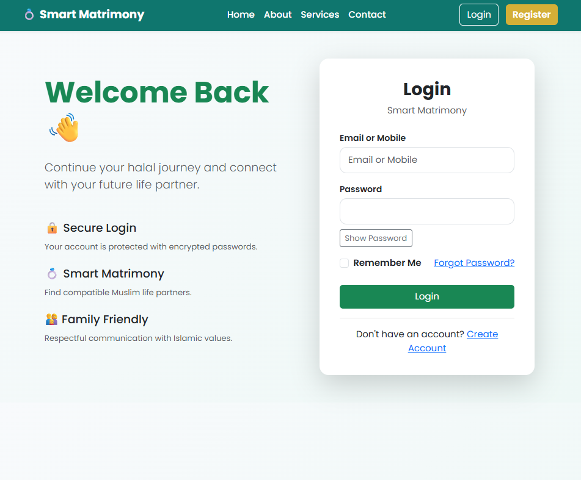
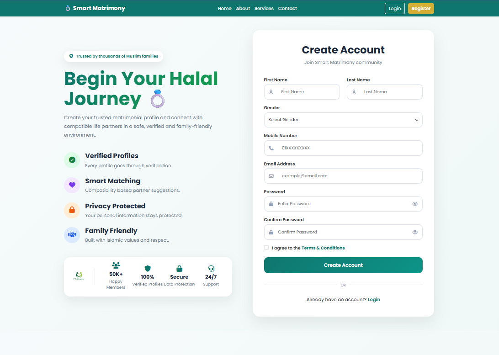

<p align="center">
  
</p>

<h1 align="center">💍 Smart Matrimony</h1>

<p align="center"><strong>Advanced Matrimony & Wedding Event Management System</strong></p>

<p align="center">
A modern PHP & MySQL based web application for partner matching, profile verification, and wedding service management.
</p>

---

## 📖 About

**Smart Matrimony** is a web-based Matrimony & Wedding Event Management System developed using **PHP** and **MySQL**.

It allows users to create verified profiles, search for suitable partners, communicate through chat, and manage wedding-related services.

---

## ✨ Features

- 👤 User Registration & Login
- 📝 Multi-Step Profile Creation
- ❤️ Partner Matching
- 🔍 Advanced Search
- ⭐ Bookmark / Favorites
- 💬 Chat System
- 🛡️ Profile Verification
- 💍 Wedding Service Booking
- 👨‍💼 Admin Panel
- ✅ Authenticator Panel

---

## 🛠️ Technologies Used

| Technology | Purpose |
|------------|---------|
| PHP | Backend |
| MySQL | Database |
| HTML5 | Structure |
| CSS3 | Styling |
| JavaScript | Client-side |
| Bootstrap | Responsive UI |
| XAMPP | Local Development |

---

## 📂 Project Structure

```text
smart_matrimony/
├── admin/
├── ajax/
├── assets/
├── auth/
├── booking/
├── chat/
├── config/
├── database/
├── includes/
├── matches/
├── profile/
├── screenshots/
├── search/
├── uploads/
├── index.php
├── login.php
├── register.php
└── dashboard.php
```

---

## 🚀 Installation

1. Clone the repository

```bash
git clone https://github.com/jibonraihan/Smart-Matrimony.git
```

2. Copy the project to:

```text
xampp/htdocs/
```

3. Import the database:

```text
database/smart_matrimony.sql
```

4. Start **Apache** and **MySQL** from XAMPP.

5. Open:

```text
http://localhost/smart_matrimony
```

---

## 📸 Screenshots

### Login Page



### Register Page



---

## 👨‍💻 Developer

**Jibon Raihan**

---

## 📄 License

This project is developed for educational purposes.

---

<p align="center">
Made with ❤️ using PHP & MySQL
</p>
